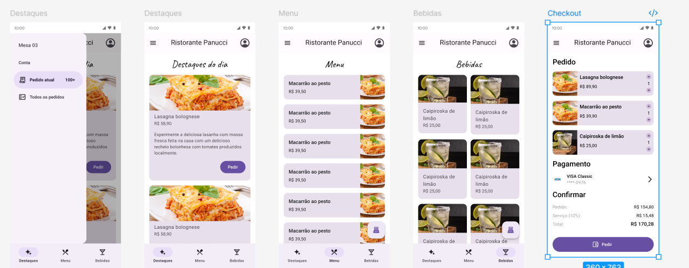

# 🍽️ App de Restaurante Popular - BomPrato

<p align="center">
  
</p>

Desenvolvido como parte da trilha de aprendizado em **Flutter** da **Alura**, o **Restaurante BomPrato** é um aplicativo mobile moderno projetado para oferecer uma experiência de pedido fluida e intuitiva. O projeto foca em um **layout responsivo**, garantindo que a interface se ajuste perfeitamente tanto em modo retrato quanto em modo paisagem. Para isso utiliza: 

```MediaQuery.of(context).orientation == Orientation.landscape ```

---

O projeto foi desenvolvido a partir do projeto original *"Ristorante Panucci"*, desenvolvido nos cursos para consolidar conceitos fundamentais de UI, navegação, componentização e gerenciamento de estado simples. Entre as modificações, foi dada uma nova cara mais popular ao app e ao cardápio.

---

## 📱 Funcionalidades

O aplicativo conta com as seguintes telas principais:

- Menu de Comidas: Catálogo completo categorizado para fácil navegação. 
- Menu de Bebidas: Catálogo completo categorizado para fácil navegação.  
- Destaques do Dia: Exibição dos pratos principais com descrições detalhadas. 
- Carrinho de Compras (Checkout): Revisão de itens selecionados, cálculo de taxas de serviço e valor total.
- Tela Inicial (Home)  

Além disso, possui um **Drawer lateral** com informações de contexto do restaurante:

- Mesa atual  
- Valor da conta  
- Pedido em andamento  
- Histórico de pedidos  

```O Drawer funciona como um painel de controle rápido para o cliente ou garçom.```

---

## 🧠 Diferencial do Projeto

### Layout Responsivo com MediaQuery

O grande foco do projeto é a **adaptação automática do layout** de acordo com a orientação do dispositivo. Utilizamos a classe MediaQuery para identificar a orientação do dispositivo e reorganizar os componentes em tempo real:

```// Exemplo de implementação no DrinkMenu e Highlights
MediaQuery.of(context).orientation == Orientation.landscape
    ? 3 // 3 colunas em modo paisagem
    : 2 // 2 colunas em modo retrato
```

Com isso, os componentes *SliverGrid* e *SliverList* se reorganizam dinamicamente, oferecendo:

- Melhor aproveitamento de espaço em tablets  
- Experiência fluida em rotação de tela  
- Layouts distintos para portrait e landscape  

### 🗃️ Database Local (cardapio.dart)

Ao invés de depender de uma API externa, o projeto utiliza persistência interna, com um **"banco de dados local" em Dart**: cardapio.dart

Esse arquivo centraliza os dados de:

- Comidas  
- Bebidas  
- Preços  
- Destaques  

### Vantagens dessa abordagem:

- Otimização de performance
- Zero custo com backend e APIs externas  
- Ideal para pequenos negócios  
- Sem dependência de internet  
- Ótimo para prototipação e MVP  

---

## 🗂️ Arquitetura do Projeto

O projeto segue uma estrutura de pastas organizada para facilitar a manutenção e escalabilidade:
```
lib/
│
├── components/
│   ├── counter_component.dart   // Contador de itens no carrinho
│   ├── drink_item.dart          // Card de bebidas
│   ├── food_item.dart           // Card de comidas
│   ├── highlight_item.dart      // Card de destaques
│   ├── main_drawer.dart         // Drawer principal
│   ├── order_item.dart          // Item de pedido
│   ├── payment_method.dart      // Forma de pagamento
│   └── payment_total.dart       // Total da compra
│
├── screens/
│   ├── home.dart                // Tela inicial
│   ├── food_menu.dart           // Menu de comidas
│   ├── drink_menu.dart          // Menu de bebidas
│   ├── highlights.dart          // Destaques do dia
│   └── checkout.dart            // Carrinho / pagamento
│
├── themes/
│   └── app_colors.dart          // Paleta de cores do app
│
├── cardapio.dart                // "Database" local
│
└── main.dart                    // Entry point
```

---
## 🎨 Assets
```
assets/
│
├── images/
│
└── fonts/
```

Os assets são usados para:

- Ilustrações dos produtos  
- Identidade visual das fontes de texto do app  
- Experiência mais realista  

---

## 🧩 Componentização

Cada parte visual do app é construída como **Widget reutilizável**, por exemplo:

- `FoodItem` → card de comida  
- `DrinkItem` → card de bebida  
- `HighlightItem` → card de destaque  
- `CounterComponent` → controle de quantidade  
- `PaymentTotal` → cálculo e exibição do valor final  

Isso garante:

- Código mais limpo  
- Fácil manutenção  
- Alta reutilização  
- Escalabilidade do projeto  

---

## 🚀 Tecnologias Utilizadas

- Flutter  
- Dart  
- Material Design  
- MediaQuery  
- Widgets customizados  
- Navegação com `Navigator`  

---

## 📚 Contexto Educacional

Projeto desenvolvido com base na **trilha de Flutter da Alura**, com foco em:

- Construção de interfaces  
- Boas práticas de organização  
- Layout responsivo  
- Simulação de app real de mercado  

---

## 🏁 Conclusão

Este projeto representa um **app completo de restaurante**, com:

- Múltiplas telas  
- Layout adaptativo  
- Componentização sólida  
- Simulação realista de fluxo de pedidos  
- Estrutura profissional de pastas  

Ideal como:

- Portfólio  
- MVP de restaurante  
- Base para projetos comerciais  
- Estudo de Flutter responsivo  


